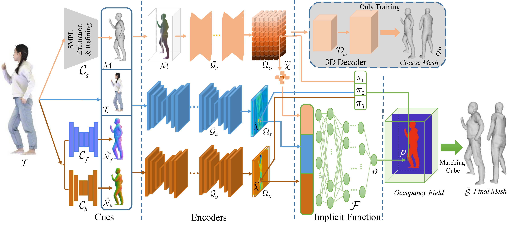

- <p align="center">
    <h1 align="center">Squeezing Multiple Cues from a Single Image for Clothed 3D Human Reconstruction</h1>
    <h4 align="center">
      <a href="http://faculty.ccnu.edu.cn/2012980050/"><strong>Leyuan Liu</strong></a>
        .
      <a href="http://sunjc0306.github.io"><strong>Jianchi Sun</strong></a>
        .
      <a href="http://sunjc0306.github.io"><strong>Yunqi Gao</strong></a>
        .
      <a href="http://nercel.ccnu.edu.cn/info/1072/3077.htm"><strong>Jingying Chen</strong></a>
      </h4>
    <h3 align="center">National Engineering Research Center for E-Learning, Central China Normal University</h3>
    <h2 align="center">Submitted to IEEE Transaction on Multimedia</h2>
  </p>

  This repository contains a PyTorch implementation of "Squeezing Multiple Cues from a Single Image for Clothed 3D Human Reconstruction". Tested with PyTorch 1.4.0 on Ubuntu 18.04, CUDA 10.1. 

    <div align="center">
      
    </div>

  **NOTE**: The current model is trained in a low-resolution dataset called THuman1.0, which contains simple poses and clothes. Fortunately, our method also achieves state-of-the-art performance on human images with complex poses and loose clothes.

  **The code is released, but  not complete. We are still updating it.**

  **NOTE 2022/11/25**:  Our paper has been submitted to *IEEE Transaction on Multimedia*. Good luck. This page shows more results generated by our method from Internet images. 

    <div align="center">
      
    </div>
    
    
  ## License

  This code and model are available for non-commercial scientific research purposes as defined in the [LICENSE](LICENSE) file. By downloading and using the code and model you agree to the terms in the [LICENSE](LICENSE).

  ## Citation

  ```bibtex
  @article{MCHuman,
    title     = {Squeezing Multiple Cues from a Single Image for Clothed 3D Human Reconstruction},
    author    = {Liu, Leyuan and Sun, Jianchi and Gao, Yunqi and Chen, Jingying.},
  }
  ```

  ## Installation
  Please run the following commands to download the necessary assets (including the pre-trained models):

  Coming Soon！

  ## Run Demo
  In ```test_example```, we provide two examples, which contain an image with a SMPL model fitted to the image and another image from the Internet. 
  ```bash
  python demo.py - input_dir                        
  ```
  ## Train the network directly using all cues
  Please run the following command to train the network:
  Coming Soon！
  ```bash
  bash 
  ```

  ## Train the network incrementally by plugging and unplugging cues 

  Please run the following command to train the network:
  Coming Soon！

  ```bash
  bash 
  ```

  

  ## Acknowledgments

  Note that some code of this repo is based on GeoPIFu, PyMAF, pix2pixHD, and openpose . We thank the authors for their great work!


  ## Contact
  - If you have any trouble when using this repo, please do not hesitate to send an E-mail to Jianchi Sun (sunjc0306@qq.com).
